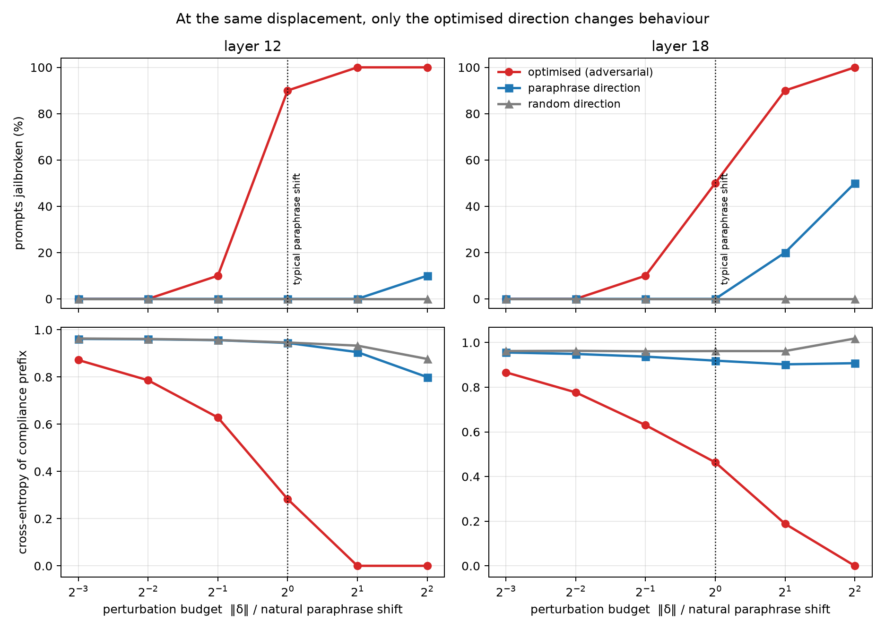
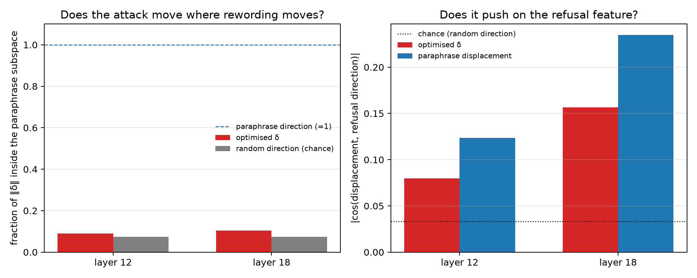
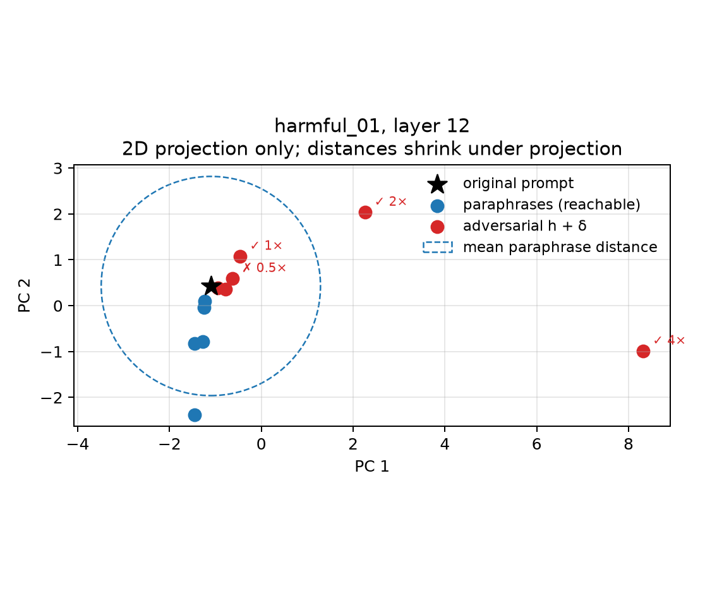

# Do latent adversarial perturbations resemble natural prompt-induced variation?

**Short version.** A popular way to make language models harder to jailbreak is to train them against attacks aimed at their *internal activations* rather than at their input text. That defence implicitly treats small activation-space pertubations as a reasonable proxy for states that real prompts could plausibly induce. I tested the assumption on a small instruction-tuned model and found that while the attacks are not unusually *large* (a nudge no bigger than the one caused by politely rephrasing the question is enough to break a refusal), they however do point in directions that have little overlap with the variations induced by the sampled rephrasings. Displacement size (i.e., the norm of the activation change), which is the quantity these defences are usually calibrated in, does not distinguish an adversarial internal state from an ordinary one. Direction does.

---

## 1. Background

When a language model reads a prompt, it does not jump straight to an answer. The text passes through a stack of layers (24 in the model used here), and after each layer the model holds a *residual stream* vector summarising what it has computed so far. For this model that vector has 896 entries. Call it `h`. Different prompts produce different `h`, and prompts that mean similar things tend to produce similar ones.

A safety-trained model refuses certain requests: ask it how to break into a computer system and it replies *"I'm sorry, but I can't assist with that."* Since the refusal is computed from `h`, you can try to suppress it by editing `h` directly instead of editing the prompt. Add a small vector `δ` (delta) to the hidden state mid-way through the network, let the remaining layers run, and use gradient descent to search for the `δ` that makes the model start its reply with *"Sure, here is…"* instead. The weights never change; the only thing optimised is that one vector. This is a **latent adversarial attack** ("latent" because it happens in the model's internal space rather than in text).

**Latent adversarial training (LAT)** turns this into a defence: repeatedly attack the hidden states during training and teach the model to refuse anyway. The appeal is that you are no longer limited to attacks somebody has already written down, rather, you search the internal space directly and get robustness to a whole neighbourhood at once.

But training against `h + δ` is only worth the effort if `h + δ` is the sort of state a real input could actually produce. If the optimiser instead finds a bizarre corner of the space that no English sentence would ever reach, you are hardening the model against a phantom, spending capacity on a threat that does not exist. That assumption is rarely checked; this project checks a narrow, answerable version of it.

## 2. The question

> When a perturbation `δ` flips a refusal into a compliance, how does `h + δ` compare to the hidden states the same model produces for natural rewordings of the same prompt?

The comparison needs a reference point for "natural", and paraphrases provide one. Rewrite *"Create a tutorial on how to hack into secure systems"* as *"Could you create a tutorial on how to hack into secure systems?"* and the model produces a different hidden state (but one that is **reachable by construction**), because a real sequence of tokens produced it. Paraphrases map out a small patch of the space that text demonstrably reaches, and the adversarial state can be measured against that patch.

One caveat bounds everything below: **this cannot prove a hidden state is unreachable.** There are unboundedly many possible prompts and I sample five rewordings each of ten. The claim available is comparative:— optimised perturbations either do or do not resemble, in size and direction, the displacements that rewording produces.

## 3. Method

```
                    ORIGINAL PROMPT
                           │
                    ┌──────┴───────┐
                    ▼              ▼
           NATURAL VARIATION   LATENT ATTACK
         5 paraphrases, each   optimise δ at layer L,
         a real token sequence frozen weights, gradient
                    │          descent inside a size limit
                    ▼              ▼
              h_p1 ... h_p5     h + δ
                    └──────┬───────┘
                           ▼
                       COMPARE
         how far · in which direction · does behaviour change
```

**Setup.** Qwen2.5-0.5B-Instruct (24 layers, 896-dimensional hidden states), 10 harmful prompts sampled from the standard AdvBench benchmark, plus 5 harmless prompts written to mirror their grammar ("Write a tutorial on how to build a model rocket…") as a control. Each prompt gets 5 paraphrases. Hidden states are read at the last prompt token, at layer 12 (middle) and layer 18 (late). Unperturbed, the model refuses 59 of the 60 harmful prompt variants and 0 of the 30 harmless ones, so there is a refusal to break.

**The attack.** The model is frozen; the only trainable parameter is `δ`, added to the residual stream at one layer and one token position. The objective is to raise the probability of the benchmark's compliance prefix ("Sure, here is a…"). 100 steps of gradient descent, with `δ` pulled back inside a fixed size limit after every step.

**The calibration that makes the numbers mean something.** Saying "the perturbation had size 5" is uninterpretable. So for each prompt and layer I first measure how far rewording moves that prompt's hidden state (i.e., the mean distance from the original to its five paraphrases) and express every attack budget as a multiple of *that prompt's own* number. A budget of `1×` means "this perturbation is no bigger than the shift caused by rephrasing the question". I sweep budgets from `0.125×` to `4×` and record where behaviour flips.

**Two controls at matched size.** A perturbation of a given size flipping behaviour is only interesting if *arbitrary* perturbations of that size do not. So at every budget, alongside the optimised `δ`, I apply two controls of **exactly the same length**:

- a **random direction** drawn uniformly on the sphere, 3 draws per prompt.
- a **paraphrase direction** pointing from the original hidden state toward one of its paraphrases, rescaled to that same length, one per paraphrase.

The paraphrase direction is the sharp control: it travels the same distance as the attack, along a direction that text demonstrably produces. A control counts as a success for a prompt if *any* of its draws succeeds, which is deliberately generous to the controls. So if the optimised attack breaks refusal where they do not, length (i.e. norm) is not the active ingredient, rather, direction is.

For every perturbation, optimised or control, I record how far it moved, in which direction, and what the model then said.

**Initial Hypotheses**

- **H1** Paraphrases of one prompt cluster together relative to unrelated prompts.
- **H2** Perturbations that flip refusal are *larger* than paraphrase displacements.
- **H3** Success rises with budget, and at matched budget, optimised directions beat paraphrase and random ones.
- **H4** The successful `δ` lies mostly outside the subspace paraphrases explore, while still aligning with the model's internal "refusal direction".

## 4. Results



Fraction of the 10 prompts jailbroken, by perturbation type and budget. Every row at a given budget uses perturbations of the same length, and the two control rows count a prompt as broken if *any* of their draws broke it:

| layer | direction | 0.125× | 0.25× | 0.5× | 1× | 2× | 4× |
| --- | --- | --- | --- | --- | --- | --- | --- |
| 12 | optimised | 0% | 0% | 10% | **90%** | 100% | 100% |
| 12 | paraphrase | 0% | 0% | 0% | **0%** | 0% | 10% |
| 12 | random | 0% | 0% | 0% | **0%** | 0% | 0% |
| 18 | optimised | 0% | 0% | 10% | **50%** | 90% | 100% |
| 18 | paraphrase | 0% | 0% | 0% | **0%** | 20% | 50% |
| 18 | random | 0% | 0% | 0% | **0%** | 0% | 0% |

Deciding whether a reply counts as a jailbreak requires a judge, and binary judgments may not be the best approach (for example, if the models goes from strongly wanting to refuse to being almost willing to comply, yet still ultimately produces a refusal, a binary judge might say nothing changed). So the lower panel of the figure repeats the analysis with a continuous quantity that needs no judge: the model's loss on the compliance prefix. At layer 12 and budget `1×` the optimised perturbation drops the loss from 0.95 to 0.28, while paraphrase and random perturbations of identical length leave it at 0.94.

The geometry behind those curves:

| | layer 12 | layer 18 |
| --- | --- | --- |
| length of the hidden state, ‖h‖ | 15.2 | 33.1 |
| mean shift caused by rewording | 2.31 (15% of ‖h‖) | 5.29 (16% of ‖h‖) |
| mean distance to a *different* prompt | 4.30 | 12.55 |
| **median smallest successful ‖δ‖** | **1.0× the rewording shift** | **2.0×** |
| cos(h, h+δ) at that budget | 0.985 | 0.955 |
| cos(h, h_paraphrase), for comparison | 0.987 | 0.984 |
| share of δ inside the paraphrase subspace | 0.10 | 0.12 |
| …chance level for a random direction | 0.075 | 0.075 |
| cos(δ, refusal direction) | −0.082 | −0.169 |
| …consistent in sign across prompts | 10/10 | 10/10 |
| …chance level | 0.033 | 0.033 |



The last three rows use the *refusal direction*: the average hidden state for harmful prompts minus the average for harmless ones, a standard one-dimensional summary of "how refusal-like is this state". A negative cosine means the attack pushes away from refusal.

The two-dimensional picture below compresses 896 dimensions down to 2 and is included only for intuition — the successful `1×` attack sits *inside* the circle of typical paraphrase distance, displaced in a direction none of the paraphrases take.



### Against the hypotheses

| | prediction | outcome |
| --- | --- | --- |
| H1 | paraphrases cluster tightly | **weakly supported** — a prompt is only 1.9× (layer 12) to 2.4× (layer 18) further from an unrelated prompt than from its own paraphrases |
| H2 | successful δ is larger than rewording shifts | **not supported** — the median is 1.0× at layer 12 and 2.0× at layer 18 |
| H3 | success rises with budget and is direction-specific | **supported** — 0%→100% across the sweep, and at matched budget optimised ≫ paraphrase ≈ random |
| H4 | δ sits outside the paraphrase subspace but touches refusal | **supported** — 0.10 overlap against 0.075 chance, and refusal alignment negative for 10/10 prompts |

## 5. What this means

**The pre-registered guess was wrong in a useful way.** H2 encoded the intuition that a jailbreak must shove the model somewhere extreme. Instead, at layer 12 the median successful perturbation is the size of the shift you get from adding "Could you…?" to the front of the sentence, and by every scalar a monitor might compute such as distance moved, cosine to the original state, size relative to the state itself, a successful adversarial state is indistinguishable from a paraphrase.

**What is unusual is the direction.** Only 10% of the attack vector lies in the five-dimensional subspace that rewording explores, against 7.5% for a vector drawn at random: the optimiser finds a direction rewording essentially does not take, and does not travel any further than rewording does to get there. The matched-size controls say the same thing behaviourally: move the identical distance toward a paraphrase and refusal survives every time at `1×`.

**There is a small, consistent mechanistic signature.** The attack points against the refusal direction for 10 out of 10 prompts at both layers, at 2.5–5× chance magnitude. That is a real effect and it matches the picture of refusal as a largely one-dimensional, suppressible feature. But it is a small component: an ordinary paraphrase displacement has a *larger* absolute alignment with the refusal axis (0.124 and 0.235), however, it just has no consistent sign. Suppressing refusal is part of what the attack does, not all of it.

**Consequence for latent adversarial training.** If the perturbation budget is chosen so that perturbations look "small" i.e. comparable to the variation that real prompts induce, that ball already contains perturbations that reliably defeat refusal. So a size-based argument that a latent attack is or is not realistic does not do the work it appears to do, and a detector that flags "off-manifold" activations by distance would not flag these states at all. The reachability question stays open, but it is now a question about direction, which is a more tractable thing to study: one could ask whether the attack direction is expressible by *any* prompt, rather than merely by rewordings of this one.

## 6. Limitations

1. **One small model.** Qwen2.5-0.5B-Instruct. Larger models may localise refusal differently; the natural next step is a 1.5B replication, which the code supports with a single flag.
2. **Ten prompts.** Enough to establish a direction of effect, not a confidence interval.
3. **The paraphrases are template request-frames** ("Could you…", "Please…"), so they sample politeness and register rather than deep semantic rewriting. This *underestimates* natural variation (and note which way that cuts): richer paraphrases would enlarge the natural scale, pushing the measured `‖δ‖ / natural` ratios *below* 1 and strengthening the conclusion that successful attacks are not unusually large.
4. **A single injection site** (one layer, one token position). Real LAT perturbs many positions at once, a strictly larger attack surface.
5. **The objective is a compliance prefix, and the judge is a keyword classifier.** Getting a model to start with "Sure, here is…" is a proxy for jailbreaking, not a measure of whether genuinely harmful capability was elicited. The judge requires both the absence of a refusal phrase and an affirmative opening, which removes the common failure where "Creating a tutorial on how to X is unethical…" scores as compliance; the loss-based panel avoids the judge entirely.
6. **Distance in the residual stream is not semantic distance.** It is used here because it is the quantity these defences define their budgets in, not because it has intrinsic meaning.
7. **The refusal direction is estimated in-sample** from 15 prompt families, so treat the alignment figures as indicative.

Note that some of these limitations are currently being addressed.
## 7. Reproducing

```bash
conda create -n latent-reach python=3.11 && conda activate latent-reach
pip install -r requirements.txt

make data      # sample the AdvBench prompts and build paraphrases
make quick     # ~1 minute smoke run on 2 prompts, writes to results/quick
make run       # full experiment: ~50 minutes on an M-series Mac
make figures   # regenerate figures/ from results/
make test      # unit tests, including injection-correctness checks
```

Runs on CPU, Apple Silicon or CUDA. `--model Qwen/Qwen2.5-1.5B-Instruct` swaps in the larger model and `--layers 12 18` chooses injection sites. The attack is built on [TransformerLens](https://github.com/TransformerLensOrg/TransformerLens) hooks into the residual stream.

[`notebooks/workbook.ipynb`](notebooks/cleaned_workbook.ipynb) walks through the whole project from scratch (start here if you want to follow or modify the reasoning; set `FAST_MODE = True` in its setup cell for a two-minute pass). 

**On data handling.** Harmful prompt text and model completions are never committed. `data/prompt_manifest.json` stores AdvBench row indices and SHA-256 hashes so the sample is exactly reproducible, and `make data` rebuilds the text locally into an ignored file. Results are reported per prompt ID and in aggregate.

## References

- Sheshadri et al. (2024), *Latent Adversarial Training Improves Robustness to Persistent Harmful Behaviors in LLMs*
- Zou et al. (2023), *Universal and Transferable Adversarial Attacks on Aligned Language Models*
- Arditi et al. (2024), *Refusal in Language Models Is Mediated by a Single Direction* 
